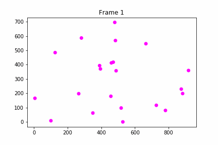

# E-Coli-Counter

Script that turns mp4 videos of bacteria into gifs of their tracked movements. This project was made to assist in my lab work at Texas A&m, and also to better understand MATLAB's capabilities. 

## Project Overview

### Thresholding

The program first looks at the first frame of the video, then asks the user to enter a threshold level to binarize the image. The binarization lets MATLAB's feature extraction algorithm recognize shapes more easily.

### Particle Filter

The thresholding step frequently creates small particles, as can be seen in the bottom right of the above image. These particles will be incorrectly analyzed as full bacteria by MATLAB's feature extraction. By applying a particle filter to each frame, we can remove the random white specks.

Notice how the bottom of the image is cleaner.

### Feature Extraction

I used the MATLAB regionprops() function to look for ellipses in each frame, and assign a bounding box to each of them. Then, I could add all the bacteria to an array and write the subsequent information into a text file.

### Python Analysis

Lastly, I wrote a Python script to parse all the .txt data into plots, then concatenate all the plots into a gif. As of now, the python analysis is very memory efficient until I can find a way to directly concatenate a pyplot into a gif, without storing the plot into an intermediate image.

## Resources Used
Blob Analysis Tutorial 
https://blogs.mathworks.com/pick/2009/11/06/segmenting-coinsa-tutorial-on-blob-analysis/

Video used in example analysis
https://www.youtube.com/watch?v=CldjFTSr4fY